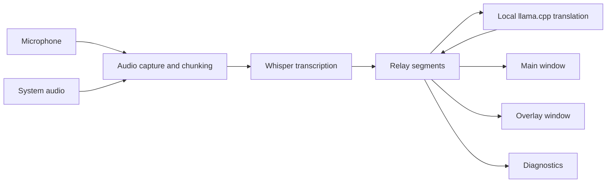

# Relay

> Hear. Relay. Understand.

[](https://github.com/hu553in/relay/actions/workflows/ci.yml)

Relay is a desktop utility for live speech transcription and local translation. It listens to microphone
audio, system audio, or both, transcribes speech with Whisper, translates segments with a local
llama.cpp-compatible model, and shows the result in a main window and overlay.

Relay is developed and tested primarily on macOS, but the codebase is structured as a Tauri 2
desktop app with platform-specific pieces isolated where practical.

## Features

- Menu-bar desktop app with controls, settings, overlay, tray menu, and global shortcuts
- Microphone capture through `cpal`
- System audio capture where the platform and runtime support it
- Local speech-to-text with `whisper-rs` and Whisper GGML `.bin` models
- Local translation with `llama-cpp-2` and llama.cpp-compatible GGUF chat or instruct models
- Recursive model discovery from configured model directories
- Transcript and translation logs with copy, clear, auto-scroll, and overlay support
- TOML settings in the user config directory
- Diagnostics UI and persisted diagnostics logs

## Limitations

- System audio support is runtime- and device-dependent and degrades gracefully when unavailable.
  - macOS and Windows use the default output-device loopback path exposed through `cpal`.
  - Linux uses PipeWire first through `pw-record`, then falls back to the PulseAudio default monitor through `parec`.
- Translation quality and availability depend on the selected GGUF model exposing a usable chat template.
- There is no hosted translation provider.
- Release builds are not signed or notarized.

## How it works



The backend owns capture, transcription, translation, app state, settings, diagnostics, tray actions,
and Tauri commands. The frontend receives snapshots and events and renders the main workspace, overlay,
settings, logs, and toast states.

## Requirements

- macOS for the current primary development target.
- Node.js 25 and `pnpm` 10, matching the CI setup.
- Rust stable with `rustfmt`, `clippy`, and `cargo-llvm-cov`.
- Tauri 2 system dependencies for the target platform.
- Optional Linux system-audio runtime tools:
  - `pw-record` for PipeWire desktops.
  - `parec` for older PulseAudio desktops or Pulse-compatible setups.
- Local model files:
  - Whisper GGML `.bin` model for transcription.
  - llama.cpp-compatible `.gguf` model for translation.

For Linux release builds, CI installs WebKit and AppIndicator dependencies. Local Linux development needs
the equivalent Tauri Linux dependencies.

## Models

Relay does not download models automatically. Configure directories in Settings and choose discovered model
files from those directories.

### Transcription models

Supported transcription models are Whisper GGML `.bin` files compatible with whisper.cpp and whisper-rs.

Recommended source:

- [ggerganov/whisper.cpp models](https://huggingface.co/ggerganov/whisper.cpp/tree/main)

Notes:

- Use multilingual models for mixed or non-English speech.
- English-only models, usually named with `.en`, are faster but suitable only for English speech.
- Relay scans the configured transcription models directory recursively for `.bin` files.

### Translation models

Supported translation models are GGUF files that can be loaded by llama.cpp and expose a usable chat
template for instruction-style prompting.

Discovery starting point:

- [Hugging Face GGUF translation candidates for llama.cpp](https://huggingface.co/models?pipeline_tag=translation&library=gguf&apps=llama.cpp)

That filter is not a compatibility guarantee. A model still needs to load locally, expose a usable chat
template, fit available memory, and produce acceptable translation output.

Relay scans the configured translation models directory recursively for `.gguf` files.

## Configuration

Relay stores settings as TOML:

```text
~/Library/Application Support/Relay/settings.toml
```

The diagnostics log is stored at:

```text
~/Library/Application Support/Relay/logs/diagnostics.log
```

Example settings:

```toml
[inputs]
microphone = true
system_audio = false

[transcription]
models_dir = "/Users/example/Models/whisper"
model_file = "ggml-small.bin"

[translation]
models_dir = "/Users/example/Models/translation"
model_file = "Qwen2.5-3B-Instruct-Q5_K_M.gguf"
target_language = "en"
max_tokens = 96

[overlay]
visible = true
always_on_top = true

[shortcuts]
toggle_listening = "CmdOrCtrl+Shift+L"
toggle_overlay = "CmdOrCtrl+Shift+O"
```

Settings can be edited through the Settings window. The Raw config tab shows a read-only preview of the
persisted TOML. Shortcut changes are loaded on app startup.

## Development

Useful commands:

```bash
pnpm install
pnpm tauri dev
pnpm check
pnpm check:fix
pnpm test:rust
pnpm build
pnpm tauri build
```

`pnpm check` runs static checks only: frontend lint/typecheck plus Rust fmt/check/clippy. Rust tests are
separate so local checks and CI can report static failures independently from backend runtime tests.
GitHub Actions runs Rust tests in a matrix across Ubuntu 22.04, Ubuntu 24.04, macOS, and Windows.

## Project structure

- `src-tauri/src/app`: application state, lifecycle, windows, diagnostics, model discovery, and runtime
  health.
- `src-tauri/src/audio`: microphone and system-audio capture abstractions and raw audio chunks.
  System-audio backends live under `src-tauri/src/audio/system`.
- `src-tauri/src/pipeline`: listening pipeline orchestration, chunking, transcription, and translation
  flow.
- `src-tauri/src/transcription`: `whisper-rs` model loading and transcription.
- `src-tauri/src/translation`: llama.cpp translation provider and health checks.
- `src-tauri/src/settings`: TOML persistence and config path handling.
- `src-tauri/src/commands`: Tauri command boundary.
- `src-tauri/src/platform`: platform-specific code.
- `src`: React + TypeScript frontend.
- `src/components`: main window, overlay, settings, shared UI, logs, and toast components.
- `src/hooks`: Tauri event subscriptions, live-log scroll behavior, and toast state.
- `src/lib`: typed frontend API wrappers, formatting, diagnostics, and segment utilities.

## UI overview

Relay has three main windows:

- Main window: live workspace. The default mode shows input toggles and transcript and translation logs.
  Stats mode replaces the live workspace with session, system, and model health stats.
- Overlay window: transparent, always-on-top live transcript and translation view.
- Settings window: inputs, transcription, translation, overlay, shortcuts, diagnostics logs, raw config,
  and about information.

The tray or menu bar menu exposes quick actions for listening, overlay visibility, controls, settings,
about, and quit.

## Diagnostics

Diagnostics are visible in Settings and are appended to `diagnostics.log`. Clearing diagnostics clears both
the in-memory UI log and truncates the file without deleting it.

Useful diagnostic states include:

- missing or invalid Whisper model
- missing or invalid translation model
- input device unavailable
- system audio unavailable
- translation failures
- shortcut validation warnings

## Troubleshooting

### Start listening is disabled

Choose a valid Whisper `.bin` model in Settings -> Transcription. Listening requires a valid transcription
model.

### Translation does not run

Choose a valid `.gguf` model in Settings -> Translation. Listening can still run without translation, but
translated output remains unavailable until the translation model is valid.

### Translation fails for a selected model

Confirm that the model:

- is a GGUF file supported by llama.cpp
- has a usable chat template
- fits local memory
- behaves as an instruction or chat model

### No microphone input

Check macOS microphone permissions and confirm a default input device exists.

### System audio is unavailable

System audio capture depends on the current platform, runtime, and device path. Relay should continue in
microphone-only mode when system audio is unavailable.

On Linux, make sure `pw-record` or `parec` is installed and executable in `PATH`; on Debian/Ubuntu,
those tools are provided by `pipewire-bin` and `pulseaudio-utils`. On Windows or macOS, make sure a
default output device is present and the OS/runtime exposes loopback capture for it.

### Logs do not appear

Open Settings -> Logs. Use the reveal action to show `diagnostics.log` in Finder.

## Release

Versioning is handled through `release-it`:

```bash
pnpm release:patch
pnpm release:minor
pnpm release:major
```

The release config bumps `package.json` and `src-tauri/Cargo.toml`, creates a tag, and pushes it.
GitHub Actions then run checks and build Tauri artifacts for macOS, Linux, and Windows release jobs.
