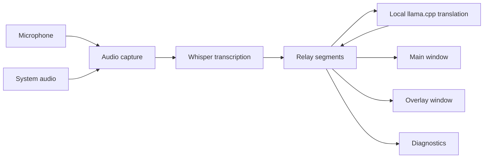

# Relay

> Hear. Relay. Understand.

[](https://github.com/hu553in/relay/actions/workflows/ci.yml)

Relay is a desktop app for live speech transcription and local translation.

It can listen to microphone audio, system audio, or both. Speech is transcribed locally with Whisper and
translated locally with a llama.cpp-compatible GGUF model. Results are shown in the main window and in an
optional overlay.

Relay is developed primarily for macOS. The app is built with Tauri, React, TypeScript, and Rust. Linux
and Windows builds exist, but platform audio support may vary.

## Features

- Live microphone transcription
- System audio capture where supported
- Local Whisper transcription with GGML `.bin` models
- Local translation with llama.cpp-compatible GGUF instruct or chat models
- Main window, overlay window, tray/menu-bar actions, and global shortcuts
- Recursive model discovery from configured directories
- Recommended model rows with one-click download
- Transcript, translation, and diagnostics logs
- TOML settings in the user config directory

## Limitations

- System audio capture depends on the platform, runtime, and selected device.
  - macOS and Windows use the default output-device loopback path exposed through `cpal`.
  - Linux uses `pw-record` first, then falls back to `parec`.
- Translation quality depends on the selected GGUF model.
- Translation requires a model with a usable chat template.
- There is no hosted transcription or translation provider.
- Release builds are currently not signed or notarized.

## How it works



The Rust backend owns audio capture, transcription, translation, settings, diagnostics, app state, windows,
tray/menu actions, and Tauri commands.

The React frontend receives snapshots and events from the backend and renders the main window, overlay,
settings, logs, and toasts.

## Requirements

- Node.js
- pnpm
- Rust with `rustfmt` and `clippy`
- Tauri 2 system dependencies for the target platform
- Optional Linux system-audio tools:
  - `pw-record` from PipeWire
  - `parec` from PulseAudio tools
- Local model files:
  - Whisper GGML `.bin` model for transcription
  - llama.cpp-compatible GGUF model for translation

macOS is the primary development target. Linux and Windows are supported as build targets,
but audio behavior depends on platform support and available runtime devices.

## Models

Relay creates a default `models` directory near its config and logs on first startup. You can also point
transcription and translation to custom directories from Settings.

Model discovery is recursive. Recommended and selected model names are matched case-insensitively, so a file
with different casing is still treated as the same model.

Recommended downloads are saved using Relay's configured `relative_path`.

### Transcription

Supported files:

- Whisper GGML `.bin`

Recommended default:

- [`ggml-small.bin`](https://huggingface.co/ggerganov/whisper.cpp/resolve/main/ggml-small.bin)

Alternatives:

- [ggerganov/whisper.cpp models](https://huggingface.co/ggerganov/whisper.cpp/tree/main)

Notes:

- Use multilingual models for mixed or non-English speech.
- English-only models usually have `.en` in the name. They are faster, but suitable only for English speech.
- Relay scans the configured transcription directory for `.bin` files.

### Translation

Supported files:

- llama.cpp-compatible `.gguf`

Recommended default:

- [`Qwen2.5-3B-Instruct-Q5_K_M.gguf`](https://huggingface.co/apto-as/Qwen2.5-3B-Instruct-Q5_K_M-GGUF/resolve/main/qwen2.5-3b-instruct-q5_k_m.gguf)

Discovery starting point:

- [Hugging Face GGUF translation candidates for llama.cpp](https://huggingface.co/models?pipeline_tag=translation&library=gguf&apps=llama.cpp)

The recommended translation model is multilingual and compact enough for the current MVP target. Its license
comes from the upstream Qwen model and repository.

Any alternative model still needs to:

- load locally through llama.cpp
- expose a usable chat template
- fit available memory
- produce acceptable translation output

Relay scans the configured translation directory for `.gguf` files.

## Configuration

Relay stores settings as TOML.

Default macOS paths:

```text
~/Library/Application Support/Relay/settings.toml
~/Library/Application Support/Relay/logs/diagnostics.log
~/Library/Application Support/Relay/models
```

Example settings:

```toml
[inputs]
microphone = true
system_audio = false

[transcription]
models_dir = "/Users/you/Library/Application Support/Relay/models"
model_file = "ggml-small.bin"
threads = 4
window_seconds = 4
hop_seconds = 2
sentence_timeout_ms = 9000

[translation]
models_dir = "/Users/you/Library/Application Support/Relay/models"
model_file = "Qwen2.5-3B-Instruct-Q5_K_M.gguf"
target_language = "en"
max_tokens = 96
context_tokens = 2048
threads = 8

[overlay]
visible = true
always_on_top = true

[interface]
ui_language = "en"

[shortcuts]
toggle_listening = "CmdOrCtrl+Shift+L"
toggle_overlay = "CmdOrCtrl+Shift+O"
```

Settings can be edited through the Settings window. The Config tab shows a read-only preview of the
persisted TOML.

Shortcut fields are validated on save. Active global shortcuts are re-registered after settings are saved.

## Tuning

Transcription settings:

- `threads`: CPU threads used by Whisper
- `window_seconds`: seconds of audio per Whisper decode
- `hop_seconds`: seconds between overlapping decodes
- `sentence_timeout_ms`: max time to hold a partial sentence before emitting it

Translation settings:

- `target_language`: ISO code like `de` or `ja`, or a custom language name
- `max_tokens`: max generated tokens per translated segment
- `context_tokens`: llama.cpp context window
- `threads`: CPU threads used by llama.cpp translation

Lower transcription windows and hops reduce latency, but increase CPU load. Higher context size can help with
longer translation prompts and outputs, but uses more memory.

## UI

Relay has three main windows:

- Main window: input toggles, transcript log, translation log, and optional stats view
- Overlay window: always-on-top live transcript and translation view
- Settings window: inputs, transcription, translation, interface, overlay, shortcuts, logs, raw config, and about

The tray/menu-bar menu exposes quick actions for listening, overlay visibility, controls, settings, about,
and quit.

## Diagnostics

Diagnostics are shown in Settings and appended to `diagnostics.log`.

Clearing diagnostics clears the in-memory UI log and truncates the log file without deleting it.

Common diagnostic cases:

- missing or invalid Whisper model
- missing or invalid translation model
- input device unavailable
- system audio unavailable
- translation failure
- shortcut validation warning

## Troubleshooting

### Start listening is disabled

Choose a valid Whisper `.bin` model in Settings -> Transcription.

Listening requires a valid transcription model.

### Translation does not run

Choose a valid `.gguf` model in Settings -> Translation.

Listening can run without translation, but translated output remains unavailable until the translation model
is valid.

### Translation fails for a selected model

Check that the model:

- is a GGUF file supported by llama.cpp
- has a usable chat template
- fits local memory
- works as an instruct or chat model

### No microphone input

Check macOS microphone permissions and make sure a default input device exists.

### System audio is unavailable

System audio capture depends on platform support and the current output-device path.

Relay should continue in microphone-only mode when system audio is unavailable.

On Linux, make sure `pw-record` or `parec` is installed and available in `PATH`.

On Debian/Ubuntu:

```bash
sudo apt install pipewire-bin pulseaudio-utils
```

On Windows or macOS, make sure a default output device exists and the OS/runtime exposes loopback capture for it.

### Logs do not appear

Open Settings -> Logs and use the reveal action to show `diagnostics.log` in the system file manager.

## Development

Useful commands:

```bash
pnpm install
pnpm tauri dev
pnpm check
pnpm check:fix
pnpm test:backend
pnpm build
pnpm tauri build
```

`pnpm check` runs frontend checks, frontend tests, Rust static checks, and backend coverage tests.
Backend coverage tests are also available separately through `pnpm test:backend`.

CI runs `pnpm check` without backend coverage tests first, then runs backend coverage tests in a
separate matrix across Ubuntu 22.04, Ubuntu 24.04, macOS, and Windows.

## Project structure

- `src-tauri/src/app`: app state, lifecycle, windows, diagnostics, model discovery, and runtime health
- `src-tauri/src/audio`: microphone and system-audio capture
- `src-tauri/src/audio/system`: platform-specific system-audio backends
- `src-tauri/src/pipeline`: listening pipeline, chunking, transcription, and translation flow
- `src-tauri/src/transcription`: Whisper model loading and transcription
- `src-tauri/src/translation`: llama.cpp translation provider and health checks
- `src-tauri/src/settings`: TOML persistence and config paths
- `src-tauri/src/recommended_models`: recommended model metadata
- `src-tauri/src/commands`: Tauri commands
- `src-tauri/src/platform`: platform-specific code
- `src`: React and TypeScript frontend
- `src/components`: main window, overlay, settings, shared UI, logs, and toasts
- `src/hooks`: Tauri subscriptions, live-log scroll behavior, and toast state
- `src/lib`: frontend API wrappers, formatting, diagnostics, and segment utilities

## Release

Versioning is handled through `release-it`:

```bash
pnpm release:patch
pnpm release:minor
pnpm release:major
```

The release config bumps `package.json` and `src-tauri/Cargo.toml`, creates a `v*` tag, and pushes it.

Pushing a `v*` tag runs the full CI path first. After checks and backend coverage tests pass, GitHub Actions
builds Tauri release artifacts for Linux, macOS Apple silicon, macOS Intel, and Windows.
